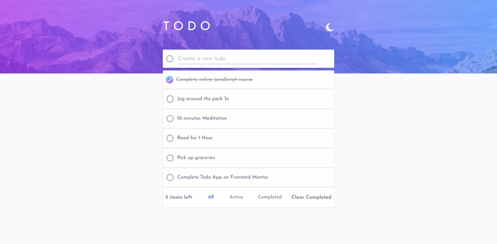

# Frontend Mentor - Todo app solution

This is a solution to the [Todo app challenge on Frontend Mentor](https://www.frontendmentor.io/challenges/todo-app-Su1_KokOW).

## Table of contents

- [Overview](#overview)
  - [The challenge](#the-challenge)
  - [Screenshot](#screenshot)
  - [Links](#links)
- [My process](#my-process)
  - [Built with](#built-with)
  - [What I learned](#what-i-learned)
  - [Continued development](#continued-development)
  - [Useful resources](#useful-resources)
- [Author](#author)

## Overview

### The challenge

Users should be able to:

- View the optimal layout for the app depending on their device's screen size
- See hover states for all interactive elements on the page
- Add new todos to the list
- Mark todos as complete
- Delete todos from the list
- Filter by all/active/complete todos
- Clear all completed todos
- Toggle light and dark mode

### Screenshot

### Links

- Solution URL: [Solution](https://github.com/shalash23/todo-fe.git)
- Live Site URL: [Add live site URL here](https://glittering-pithivier-1f9753.netlify.app/)

## My process

### Built with

- [React](https://reactjs.org/) - JS library
- [Material UI 5](https://mui.com/) - React framework
- [Styled Components](https://styled-components.com/) - For styles
- [Framer Motion](https://framer.com)

### What I learned

How to use Material UI and React Hooks. This was really a very good challenge to be able to utilize React and Material UI together which is a first for me

### Continued development

More Material UI projects to be more comfortable with it.

### Useful resources

- [Stack Overflow](https://www.stackoverflow.com) - No need to explain

## Author

- Website - [Mohamed Shalash](https://www.github.com/shalash23)
- Frontend Mentor - [@yourusername](https://www.frontendmentor.io/profile/shalash23)
